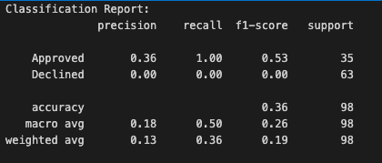

# Loan_Application_Data
The data has 615 rows and 14 features used in a model to predict loan approval

Overview

I aimed to create a Keras Neural Network model to aid in identifying approved and declined loans for a hypothetical mortgage lender. This is important because lenders need to understand what factors lead to approved and declined loan applications. Analyzing and utilizing model data on the creditworthiness of borrowers by using data from the application such as marital status, income, self-employment status, and loan amount can help lenders understand what factors pose risks and confidently identify and underwrite low, moderate and high risk loans. Communication of these factors can provide a better experience for the customers, consultants, processors, underwriters and other risk managers who may be involved with the transaction by protecting the customer and lender from costly loan default and establishing an appetite for what risk can and can't be tolerated by the lender.

Key Takeaways

While the model is still a work in progress. There does appear to be overfitting. Overfitting occurs when the model learns the training data well; however, it fails to generalize with new data. A reason for this is likely due to the small dataset. Originally containing 615 rows, the dataset was reduced further by cleaning to 390 rows. A smaller subset of data was used for the training set, so that an even smaller portion could be used to test on. The Classification Report is included below with a high level explanation of the findings.

Precision for 'Approved': 0.36 - Only 36% of instances predicted as 'Approved' are correct.

Recall for 'Approved': 1.00 - The model is capturing all actual 'Approved' instances, but is not correctly classifying 'Declined' instances.

F1-score for 'Approved': 0.53 - The harmonic mean of precision and recall is relatively low. The range is between 0 to 1, where a lower score indicates a weak balance between precision and recall.

Precision, Recall, and F1-score for 'Declined': All are 0.00, indicating that the model fails to identify instances of 'Declined' class. This is unacceptable as a final product, so more work needs to be done to either acquire more data or tune the parameters such as nodes, layers, activation methods, epoch and/or binning. 

Accuracy: 0.36 - The overall accuracy is low, suggesting the model is not performing well on the testing dataset.